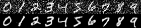

# CUDA Denoising autoencoder
<center></center>

Model architecture and training code along with tests is in `denoising.ipynb`.  
The model was trained using PyTorch and weights were exported via numpy.

### Build and usage
To build the app run the following commands from command line
```bash
mkdir build
cd build
cmake ..
make
```
NOTE: you have to manually set the nvcc compiler in CMakeLists.txt  
`set(CMAKE_CUDA_COMPILER /usr/local/cuda-11.6/bin/nvcc)`

One executable is created: `denoiser` which loads the network weights from `model_weights` and denoises the image

Running the app:
```
MNIST denoising via CNN autoencoder
usage: ./denoiser input_image output_image --benchmark num_runs

Options:
  --benchmark   (optional) number of runs for benchmarking

Help:
  -h            Show this text
```
Example launch and output:
```
./denoiser ../test_images/9_big.png ./big.png

Denoising ../test_images/9_big.png and saving the result to ./big.png
Run 0
Took 7465[µs] to complete (without allocation)
Took 82019[µs] to complete (with allocation)
Mean runtime over 1 runs: 7465[µs] (without allocation)
Mean runtime over 1 runs: 82019[µs] (with allocation)
```
### Requirements
`cnpy` is used to load numpy arrays with it comes `zlib` dependency  

The code was tested using Ubuntu 18.04 with CUDA 11.6  
On a computer with AMD Ryzen 7 3700X CPU and NVIDIA GeForce GTX 1080 GPU

### Optimizations
1. Inplace activation functions  
_Speed gain is marginal (on 256x256 images was 1.5%)_